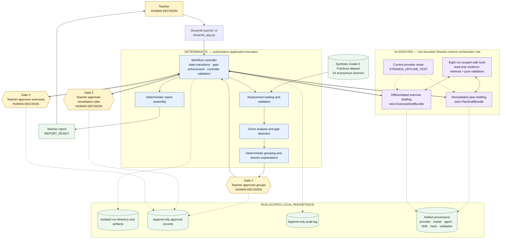

# GapBridge Architecture

This document describes the architecture implemented in the current local
hackathon demo. It distinguishes deterministic authority, AI-assisted drafting,
and teacher decisions explicitly.



Color is supplementary: every decision boundary is also labeled
**DETERMINISTIC**, **AI-ASSISTED**, or **HUMAN DECISION** in text.

## Implemented component map

| Responsibility | Implemented by |
|---|---|
| Teacher interface and refresh-safe run reopening | `streamlit_app.py`, `sprint4b_service.py` |
| Assessment validation and score analysis | `assessment.py`, `gaps.py` |
| Deterministic grouping and explanations | `grouping.py`, `config.py` |
| Authoritative workflow and three gates | `sprint3_workflow.py`, `state.py` |
| One bounded Strands orchestration role | `strands_orchestrator.py` |
| Safe evidence and validation tools | `sprint3_tools.py` |
| Strict structured-output contracts | `sprint3_schemas.py` |
| Run isolation, approvals, hashes, and local persistence | `sprint3_storage.py` |
| Deterministic report assembly | `sprint3_report.py` |

## Authority boundaries

- **Deterministic:** assessment validation, scoring, learning gaps, group
  membership, target constraints, state transitions, approval enforcement,
  structured-output revalidation, artifact persistence, and report assembly.
- **AI-assisted:** remediation-plan wording and differentiated exercise drafting
  within approved deterministic constraints. Teacher revision feedback may
  guide later draft wording.
- **Human decision:** approval of groups, remediation plans, and exercises.

The orchestrator can retrieve evidence or run pure validation through its eight
allowlisted tools. It cannot change groups, advance workflow state, approve an
artifact, write files, or assemble the final report.

## Provider status

The current demo mode is `STRANDS_OFFLINE_TEST`. A deterministic scripted local
model drives the real Strands Agent tool loop and structured-output path, so
the demo remains repeatable without an external model call.

The provider interfaces can accept a future Bedrock-backed implementation, but
Bedrock is not operational in this project. The approved availability test for
Amazon Nova Lite in `us-east-1` returned:

```text
ValidationException: Operation not allowed
```

Bedrock is therefore **provider-ready / pending AWS account authorization**.
AgentCore is not implemented or represented in this architecture.
